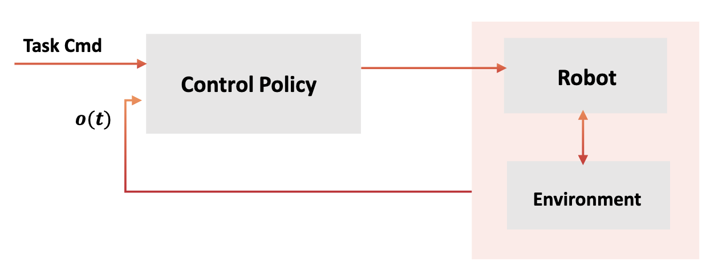

# Lecture10: **Markov Decision Process for Reinforcement Learning**

> Notes taken by [squarezhong](https://github.com/squarezhong)
> Repo address: [squarezhong/SDM5008-Lecture-Notes](https://github.com/squarezhong/SDM5008-Lecture-Notes)

[toc]

## From Classical Control to RL

- What control do?

- Comparison

| Classical Control | Modern Control | MPC  | Reinforcement Learning |
| ----------------- | -------------- | ---- | ---------------------- |
|                   |                |      |                        |

## Markov Chain

Markov Chain: $\text{MC} = (S,\Gamma)$

- $S$ : state space (discrete or continuous)

- $\Gamma$ : transition operator, i.e. $\Gamma(x|y) = Pr(s_{t+1}=x|s_t=y)$

- Initial distribution $p_0(s) = \text{Pr}(S_0 = s)$

- For discrete state space, the transition operator has a matrix representation.

- MC with $P_0$ specifies a way to generate sequential random samples $s_0,s_1,\cdots$ , which is called **realization/trajectory** of the MC.
- Markov chain can be seen as a stochastic dynamical system that
  - $s_{k+1} = f(s_k, w_k)$ or $s_{k+1} = f(s_k) + w_k$ where $w_k$ is a random variable (process noise)

## Markov Decision Process

## Bellman Equations

## Simulations