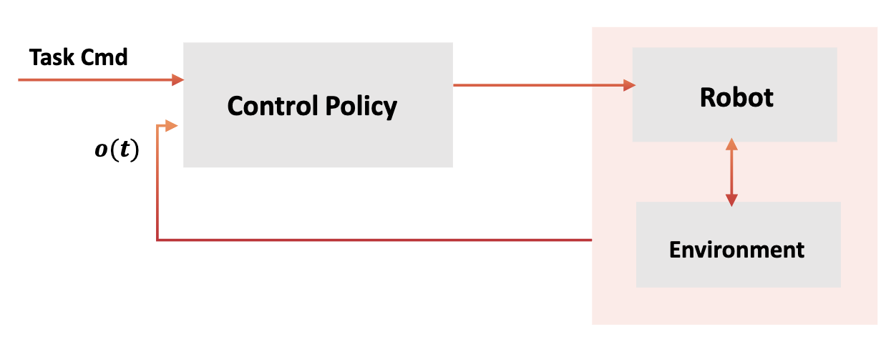
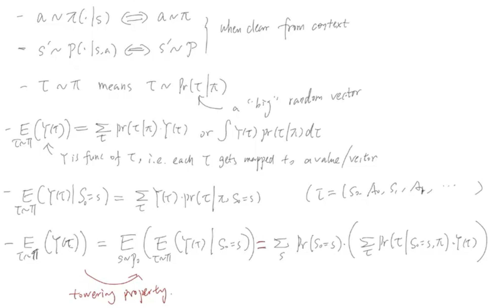
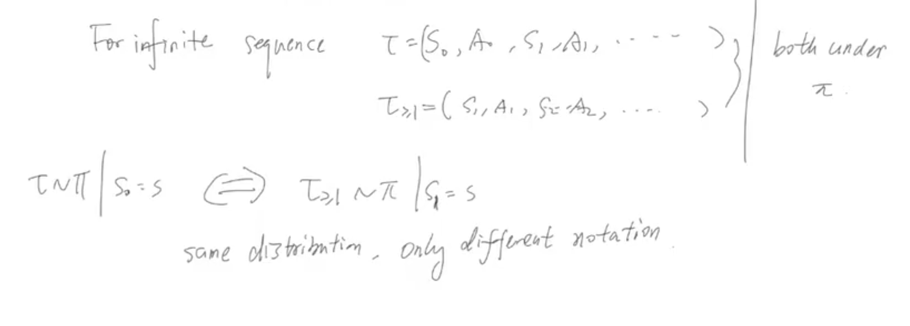
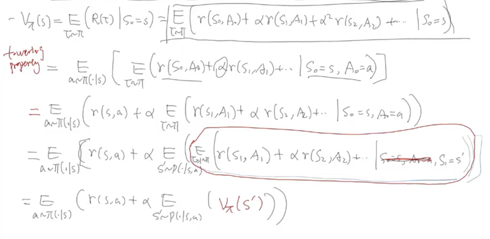
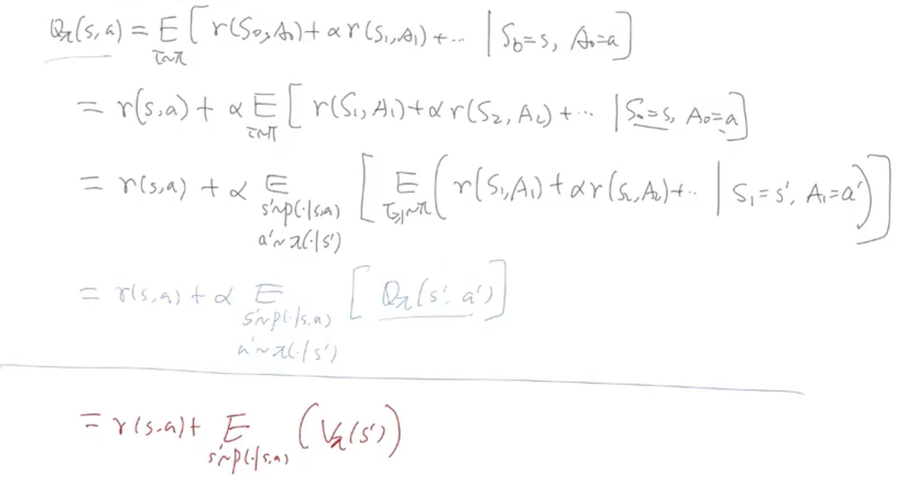

# Lecture10: Markov Decision Process for Reinforcement Learning

> Notes taken by [squarezhong](https://github.com/squarezhong)
> Repo address: [squarezhong/SDM5008-Lecture-Notes](https://github.com/squarezhong/SDM5008-Lecture-Notes)

[toc]

## From Classical Control to RL

### What control do?

### Comparison

| Classical Control                   | Modern Control                                               | MPC                                                 | Reinforcement Learning |
| ----------------------------------- | ------------------------------------------------------------ | --------------------------------------------------- | ---------------------- |
| linear system frequency domain | state space linear system  limited class of nonlinear | state space linear and nonlinear (large scale) | complex model          |
| analytical                          | analytical                                                   | computational                                       | data driven            |

- Most above are "model" based method.
  - classical/modern: $\text{model}\xrightarrow{\text{analytical/definition}}\text{policy}$
  - MPC: $\text{model}\xrightarrow{\text{formulate}}\text{optimization}\to \text{policy}$
  - RL: $\text{model}\to \text{data}\to \text{policy}$

#### Typical optimization problem

$$
\min{f(x)}\quad \text{subject to } g(x) \leq 0
$$

1. typically $x \in \mathbb{R}^n$, finite dimensional optimization variable
2. objective function $f: \mathbb{R}^n \to \mathbb{R}$, easy to define and compute
3. deterministic

#### RL

$$
\max{\text{Reward}(\pi)}\quad \text{for all policies } \pi
$$

1. optimization variable policy $\pi$ infinite dimensional
2. objective function (functional 泛函) $\text{Reward}: \text{policy} \to \text{scalar}$ 
   elevation of reward requires simulation $\text{robot} \leftrightarrow \text{env}$
3. probalistic/stochastic problem due to intrinsic uncertainty

## Markov Chain

Markov Chain: $\text{MC} = (S,\Gamma)$

- $S$ : state space (discrete or continuous)

- $\Gamma$ : transition operator, i.e. $\Gamma(x|y) = \text{Pr}(s_{t+1}=x|s_t=y)$

- Initial distribution $p_0(s) = \text{Pr}(S_0 = s)$

- For discrete state space, the transition operator has a matrix representation.

- MC with $P_0$ specifies a way to generate sequential random samples $s_0,s_1,\cdots$ , which is called **realization/trajectory** of the MC.
- Markov chain can be seen as a stochastic dynamical system that
  - $s_{k+1} = f(s_k, w_k)$ or $s_{k+1} = f(s_k) + w_k$ where $w_k$ is a random variable (process noise)

## Markov Decision Process

System future behavior depends on state $s_t$ and external impact (control/action)

$\text{MDP} = (S,\mathcal{A},\Gamma,r)$

- $S$: state space (discrete or continuous)

- $\mathcal{A}$: action/control space (discrete or continuous)

- $\Gamma$: transition kernel/operator

  $\Gamma(s'|s,a)=\text{Pr}(S_{t+1}=s'|S_t=s,A_t=a)=p(s'|s,a)$

- $r$: reward function: $r(s,a,s')$ or typically $r(s,a)$

### Policy

- Markov decision: agent makes decision based on current stats

- $\pi(a|s)$ is the pdf/pmf of action $a$ given the current state $s$

  i.e. $\pi(a|s)=\text{Pr}(A=a|S=s)$

- Deterministic policy $a=\pi(s)$

- Time varying policy, $\pi_t(a|s)$

- Policy within a class of functions with certain parameters $\theta$

### Trajectories of MDP

- Given policy $\pi$, a finite horizon $T$

- MDP becomes a **MC** with "closed-loop" transition operator $\Gamma_{cl}$

  $\Gamma_{cl}(s'|s)=\text{Pr}(S_{t+1}=s'|S_t=s)=\sum_{a}p(s'|s,a)\pi(a|s)$

- Trajectory $\tau=(s_0,a_0,s_1,a_1,...,s_T,a_T)$ is a trajectory of MDP under a policy $\pi$

- Probablity of a trajectory $P(\tau|\pi)=p(s_0)\prod_{k=0}^{T-1}p(s_{k+1}|s_k,a_k)$

### Notations

### Return

Cumulative rewards over a trajectory, which may take several different forms.

- Finite-horizon (undiscounted) return $R(\tau)=\sum_{t=0}^T r(s_t,a_t)$

- Infinite-horizon discounted return $R(\tau)=\sum_{t=0}^{\infty}\alpha^{t}r_t$

  where $\alpha\in(0,1)$ is discount factor, future reward is less important than immediate reward

MDP (RL) Problem: $\max{E_{\tau \sim \pi}[R(\tau)]}$

## Bellman Equations

### Value functions

- On-policy (state)-value function: 

  $V_{\pi}(s)\triangleq E_{\tau \sim \pi}(R(\tau)|S_0=s)$

  evaluate rhe "performance" of a given policy $\pi$

- On-policy action-value function (Q-function)

​	$Q_{\pi}(s,a)=E_{\tau \sim \pi}[R(\tau)|S_0=s,A_0=a]$	

- Optimal value function

  $V^{*}(s)=\max\limits_{\pi}(E_{\tau \sim \pi}(R(\tau)|S_0=s))$

- Optimal action-value function

  $Q^{*}(s,a)=\max\limits_{\pi} (E_{\tau \sim \pi}[R(\tau)|S_0=s,A_0=a])$

By definition, we have the following deduction

- $V_{\pi}(s) = E_{a \sim \pi}[Q_{\pi}(s, a)]$

- $ V^*(s) = \max\limits_a Q^*(s, a) $

### Bellman Equations

> Bellman equation is a **necessary condition** for optimality associated with the mathematical optimization method known as dynamic programming. It writes the "value" of a decision problem at a certain point in time in terms of the payoff from some initial choices and the "value" of the **remaining decision problem** that results from those initial choices. [[source]](https://en.wikipedia.org/wiki/Bellman_equation)

Infinite-horizon discounted return case

- $V_{\pi}(s)$

- $Q_{\pi}(s,a)$

- Summary

## Sampling

Use random samping to

- simulate a MC or MDP
- evaluate high-dim expectations in RL

### Monte Carlo Method

#### Intrinsic

- $X_1 ,X_2, ...,X_n$ i.i.d random vectors
- $E(X_i)=\mu_X,\ Cov(X_i)=Q_X$

#### Estimation

- Sample mean: $\bar{X}_n=\frac{1}{n}\sum X_i \to \mu_X$
- Sample covariance: $\bar{Q}_n = \frac{1}{n-1} \sum_i (X_i - \bar{X}_n)(X_i - \bar{X}_n)^T \to Q_X$
- unbiased estimate: $E(\bar{X}_n)=\mu_X, E(\bar{Q}_n)=Q_X$

#### Central limit theorem (CLT)

$\sqrt{n}(\bar{X}_n - \mu_X) \to \mathcal{N}(0,Q_X)$ in distribution

- $\bar{X}_n$ can be approximated by gaussian distribution $\mathcal{N}(\mu_X,\frac{Q_X}{n})$
- Covariance  $E[(\bar{X}_n - \mu_X)(\bar{X}_n - \mu_X)^T] \approx \frac{Q_X}{n}$
- MSE of the estimate $\bar{X}_n$ is $trace(\frac{Q_X}{n})$

### Monte Carlo Integration

- $E(\phi(X)) = \frac{1}{n}\sum\limits_i \phi(X_i)$
- $P(X \in A) = E(1_A(X)),
  1_A(X) =  
  \left\{
  \begin{aligned}
  & 1, \text{if } X \in A \\
  & 0, \text{otherwise}
  \end{aligned}
  \right.
  $

$X_i \sim f_X(x)$ are i.i.d samples

### Importance sampling

Estimate $E_g(X)=\sum_x xg(x)$ with sample from $f(x)$ distribution
$$
E_g(\phi(X)) = \sum_x \phi(x) g(x)  =\sum_x (\phi(x)\frac{g(x)}{f(x)})f(x) = E_f(\phi(x)\frac{g(x)}{f(x)}) \approx \frac{1}{N}\sum_i \frac{g(X_i)}{f(X_i)}\phi(X_i)
$$
> $f(x)$ and $g(x)$ are both known

Benefits:

- possibly reduce final **sample variance**
- $f$ is easier to evaluate and sample than $g$

Application

- $\displaystyle \int g(x) dx = \int g(x) \frac{1}{f(x)} f(x) dx = E_f(g(x) \frac{1}{f(x)}) \approx \frac{1}{N} \sum_i g(X_i)\frac{1}{f(X_i)}$
