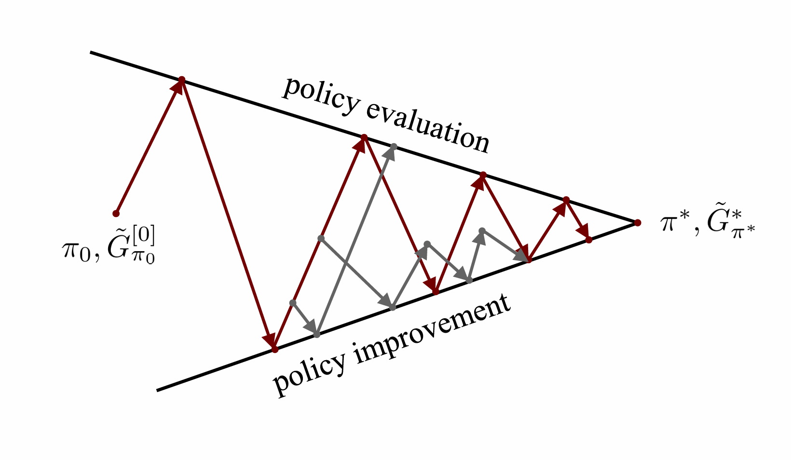

# Lecture12: Value Estimation

> Notes taken by [squarezhong](https://github.com/squarezhong)
> Repo address: [squarezhong/SDM5008-Lecture-Notes](https://github.com/squarezhong/SDM5008-Lecture-Notes)

[toc]

## Algorithm: MC estimation, for estimating state values

### Notation

For a finite trajectory $\tau = \{s_t, a_t, r_{t+1}\}_{t=0}^{T-1}$
$$
G_t = G(s_t) = R(\tau|S_0 = s_t) = r_{t+1}+ \gamma r_{t+2} + \cdots + \gamma^{T-1}r_T
$$
Corollary:
$$
G(s_t) = r_{t+1} + \gamma G(s_{t+1})
$$

### Process 

- Input: policy $\pi$ to be evaluate
- Output: $V_{\pi}^{*}(s)$
- Init: 
  - $V(s) \in \mathbb{R},\ \forall s \in \mathbb{S}$  
  - an empty list $R(s),\ \forall s \in \mathbb{S}$  

---

Loop for each episode: (termination: $\max V_{\pi}^{[k+1]}(s_t) - V_{\pi}^{[k]}(s_t) \leq \Delta$)

​	generate $\tau = \{s_t, a_t, r_{t+1}\}_{t=0}^{T-1}$ using $\pi$

​	$G_t \leftarrow 0$

​	Loop for each time step $t = T-1, T-2, \cdots, 0$:

​		$G_t \leftarrow r_{t+1} + \gamma G_{t+1}$

​		$R(s_t)$ append $G_t$

$\hat{V_{\pi}}(s_t) \leftarrow \text{average}(R(s_t))$

---

Above is the **"every visit"** condition.

This calculates the value function for all possible states?

### Examples

- [Frozen Lake]([Frozen Lake - Gym Documentation](https://www.gymlibrary.dev/environments/toy_text/frozen_lake/))

- [Example Code]([rl-start/notebook/value_estimation.ipynb at master · clearlab-sustech/rl-start](https://github.com/clearlab-sustech/rl-start/blob/master/notebook/value_estimation.ipynb))

### Incremental Implementation

$$
\begin{equation}
V_{\pi}^{[m+1]}(s_t) = V_{\pi}^{[m]} + \frac{1}{m+1}
\left(
G_t^{[m+1]} - V_{\pi}^{[m]}(s_t)
\right)
\end{equation}
$$

New Estimation $\leftarrow$ Old Estimation + $\alpha$ (New Observation - Old Estimation)

This significantly reduces the storage requirements.

Derivation:
$$
\begin{aligned}
V_{\pi}^{[m+1]}(s_t) &= 
\frac{1}{m+1} \sum_{i=1}^{m+1} G_t^{[i]} \\
&= \frac{1}{m+1} \left( \sum_{i=1}^{m} G_t^{[i]} + G_t^{[m+1]}\right) \\
&= \frac{1}{m+1} \cdot m \cdot \frac{1}{m} \left( \sum_{i=1}^{m} G_t^{[i]} + G_t^{[m+1]}\right) \\
&= \frac{m}{m+1} V_{\pi}^{[m]}(s_t) + \frac{1}{m} G_t^{[m+1]}\\
&= \frac{1}{m+1} 
\left(
(m+1) V_{\pi}^{[m]}(s_t) - V_{\pi}^{[m]}(s_t) + G_t^{[m+1]}
\right) \\
&= V_{\pi}^{[m]}(s_t) + 
\frac{1}{m+1} \left( G_t^{[m+1]} - V_{\pi}^{[m]}(s_t) \right)
\end{aligned}
$$

## From Monte-Carlo (MC) to Temporal Difference (TD)

- Limitation of MC methods: require finished episodes

- TD: $G_t \approx r_{t+1} + \gamma \hat{V}_{\pi}(s_{t+1})$, applies if some applications have very long episodes

$$
V_{\pi}^{[m+1]}(s_t) = V_{\pi}^{[m]}(s_t) + \alpha
\left(
\underbrace{r_{t+1}^{[m+1]} + \gamma \hat{V}_{\pi}(s_{t+1})}_{\text{TD Target}}
- V_{\pi}^{[m]}(s_t)
\right)
$$

The right side of $\alpha$ is call **TD Error**

### TD with $n$-step returns

- 1-step TD: $G_t \approx r_{t+1} + \gamma \hat{V}_{\pi}(s_{t+1})$

- 2-step TD: $G_t \approx r_{t+1} + \gamma r_{t+2} + \gamma^2 \hat{V}_{\pi}(s_{t+2})$

- n-step TD: $G_t \approx r_{t+1} + \gamma r_{t+2} + \cdots + \gamma^{n-1}r_{t+n} + \gamma^n\hat{V}_{\pi}(s_{t+n})$
- Monte Carlo methods could be considered as $\infty$-step TD methods.

### Rules for action-values

- MC: $Q_{\pi}^{[m+1]}(s_t,a_t) = \frac{1}{m+1} \sum_{i=1}^{m+1} G_t^{[i]}$
- MC-incremental: $Q_{\pi}^{[m+1]}(s_t, a_t) = Q_{\pi}^{[m]}(s_t,a_t) + \frac{1}{m+1}(A_t^{[m+1]} - Q_{\pi}^{[m]}(s_t,a_t))$
- $n$-step TD: $G_t \approx r_{t+1} + \cdots + \gamma^{n-1} r_{t+n} + \gamma^n\hat{Q_{\pi}}(s_{t+n},a_{t+n})$

### Trade-off between bias and variance: 

- MC methods: unbiased, high variance
- TD methods: biased, low variance
- $n$-step TD methods: the choice of $n$ serves as a **trade-off** between bias and variance in value estimation

### $\lambda$-return: $\text{TD}(\lambda)$ algorithm

#### Definition

Infinite Case:
$$
G_t^{\lambda} = (1-\lambda)\sum_{l=1}^{\infty} \lambda^{l-1} G_{t:t+l}
$$
Estimating the value functions using the  TD method computed with the $\lambda$-return.

Another method to trade off between the bias and variance of the estimator. Empirically better than fixed $n$-step return.

#### Notation

$G_{t:t+n}$ is equivalent to the $n$-step TD
$$
G_{t:t+n} = r_{t+1} + \gamma r_{t+2} + \cdots + \gamma^{n-1}r_{t+n} + \gamma^n \hat{V}_{\pi}(s_{t+n})
$$

#### Derivation

$$
\begin{aligned}
G_t^{\lambda} &= (1-\lambda)(G_{t:t+1} + \lambda G_{t:t+2} + \lambda^2 G_{t:t+3} + \cdots)\\
&= (1-\lambda)(r_{t+1} + \gamma \hat{V}_{\pi}(s_{t+1}))
+ (1-\lambda)\lambda(r_{t+1}+\gamma r_{t+2} + \gamma^2 \hat{V}_{\pi}(s_{t+2})) + \cdots \\
&= (1 - \lambda)
[
(1+\lambda+\lambda^2+\cdots)r_{t+1} 
+ \gamma \lambda (1+\lambda+\lambda^2)
+ \gamma^2 \lambda^2 (1+\lambda+\lambda^2)
] \\
& \quad \quad + (1-\lambda)
(
\gamma \hat{V}_{\pi}(s_{t+1})
+ \gamma^2 \lambda \hat{V}_{\pi}(s_{t+2})
+ \gamma^3 \lambda^2 \hat{V}_{\pi}(s_{t+3})
) \\
&= \sum_{l=1}^{\infty} 
\left[ 
(\gamma \lambda)^{l-1} r_{t+l} +
(1-\lambda)\gamma^l \lambda^{l-1}\hat{V}_{\pi}(s_{t+l})
\right]
\end{aligned}
$$

Intermediate expressions used:

- $1 + \lambda + \lambda^2 + \cdots = \lim_{n \to \infty} \frac{1-\lambda^{n+1}}{1-\lambda} = \frac{1}{1-\lambda}$

#### Discussion

Observe the form 
$$
G_t^{\lambda} 
= \sum_{l=1}^{\infty} 
\left[ 
(\gamma \lambda)^{l-1} r_{t+l} +
(1-\lambda)\gamma^l \lambda^{l-1}\hat{V}_{\pi}(s_{t+l})
\right]
$$
2 Special cases:

- $\lambda=0: G_t^0 = t_{t+1} + \gamma \hat{V}_{\pi}(s_{t+1})$

  This is 1-step return TD

- $\lambda=1: G_t^1 = r_{t+1} + \gamma r_{t+2} + \gamma^2 r_{t+3} + \cdots$

  This is Monte Carlo ($\infty$-step return)

When $0 < \lambda < 1$:

- $\lambda$-return offers a compromise between bias and variance controlled by $\lambda$

#### Finite Case

assume all rewards after step $T$ are $0$
$$
G_{t:t+n} = G_{t:t+T},\ \forall n \geq T-t
$$
Then the general form of $\lambda$-return under finite case is:
$$
\begin{aligned}
G_t^{\lambda} &= (1-\lambda) 
\sum_{l=1}^{T-t-1} \lambda^{l-1} G_{t:t+l} +
(1-\lambda) \sum_{l=T-t}^{\infty}
(1+\lambda+\lambda^2+\cdots) \lambda^{T-t-1} G_{t:T} \\
&= \sum_{l=1}^{T-t-1} \lambda^{l-1} G_{t:t+l} +
\lambda^{T-t-1} G_{t:T}
\end{aligned}
$$

### Summary

$$
\hat{V}_{\pi}^{[m+1]}(s_t) 
\leftarrow 
\hat{V}_{\pi}^{[m]}(s_t) +
\frac{1}{m+1} (G_t^{[m+1]} - \hat{V}_{\pi}^{[m]}(s_t))
$$

To estimate $G_t^{[m+1]}$, we can use:

- $\infty$-step return -> MC
- (n) 1-step return -> TD

- $\lambda$-return -> $\text{TD}(\lambda)$

## Further Expansion

### Value Parameterization

> Q: If there are a large number of or infinitely many states, it is difficult or impossible to storage all state values.

Solution: Using a **function approximator** (e.g. neural network) to estimate the state-value function $\hat{V}_{\pi}(s;w)$

---

Find $w^*$ s.t. $w^* = \text{argmin}\ E_{\pi} [(y_t - \hat{V}_{\pi}(s_t;w))^2]$

- $y_t$ is the true value but may be not accessible 

- we can use TD-target $r_{t+1} + \gamma \hat{V}_{\pi}(s_{t+1};w)$ to replace $y_t$

MSE Loss:
$$
L(w) = \frac{1}{N} \sum_i
(
r_{t+1}^{[i]} + \gamma \hat{V}_{\pi}(s_{t+1}^{[i]};w)
- \hat{V}_{\pi}(s_t^{[i]};w)
)
$$

---

### Truncated Policy Evaluation

Truncate early before evaluation converges to improve the policy improvement speed.

### Difference between leveraging state-values and action-values

Answers from ChatGPT 4o

> In practice, **state-values** are used when you're interested in evaluating or improving a policy in a model-based way, whereas **action-values** are more commonly used in model-free reinforcement learning algorithms, allowing agents to directly learn the optimal policy by interacting with the environment.
