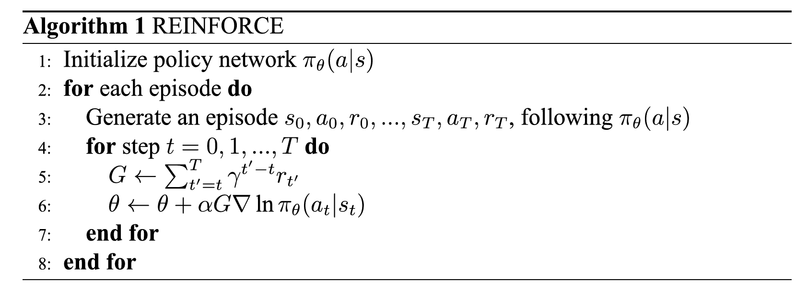

# Lecture13: Baseline and Actor-Critic

> Notes taken by [squarezhong](https://github.com/squarezhong)
> Repo address: [squarezhong/SDM5008-Lecture-Notes](https://github.com/squarezhong/SDM5008-Lecture-Notes)

[toc]

## Reinforce

According to policy gradient
$$
\nabla_\theta J(\pi_\theta) = \mathbf{E}_{\tau \sim \pi_\theta} \left[ \sum_{t=0}^T \nabla_\theta \log \pi_\theta(a_t | s_t) G_t \right]
$$
Pseudo code:

For detailed python code, you can find in many RL tutorials.

## Reinforce with Baseline

A result of the EGLP lemma: 

> For any function $b$ that depends solely on the state, we have
> $$
> \mathbf{E}_{a_t \sim \pi_\theta} \left[ \nabla_\theta \log \pi_\theta(a_t | s_t) b(s_i) \right] = 0
> $$

Then we have **policy gradient with baseline**
$$
\nabla_\theta J(\pi_\theta) = \mathbf{E}_{\tau \sim \pi_\theta} \left[ \sum_{t=0}^T \nabla_\theta \log \pi_\theta(a_t | s_t) \left( G_t - b(s_t) \right) \right]
$$

- Any function $b$ is called a baseline.
- In general the baseline doesn't change the expected value, but has a large effect on its variance.

- The most common choice of baseline is the **value function** $V(s_t)$
- In practice, $V(s_t)$ is usually approximated by a neural network $V_{\phi}(s_t)$ , which is updated concurrently with the policy.

$$
\nabla_\theta J(\pi_\theta) = \mathbf{E}_{\tau \sim \pi_\theta} \left[ \sum_{t=0}^T \nabla_\theta \log \pi_\theta(a_t | s_t) \left( G_t - V(s_t) \right) \right]
$$

Pseudo code:

Attention:

- parameters in value network should not attend the backward process. `value.item()` may be used.

## Actor-Critic

More general policy gradient form:
$$
\nabla_\theta J(\pi_\theta) = \mathbf{E}_{\tau \sim \pi_\theta} \left[ \sum_{t=0}^T \nabla_\theta \log \pi_\theta(a_t | s_t) f_t \right]
$$
$f_t$ can take take on various forms
$$
\begin{aligned}
1. & \quad \sum_{t'=t}^T \gamma^{t'-t} R_{t'} \\[10pt]
2. & \quad \sum_{t'=t}^T \gamma^{t'-t} R_{t'} - b(s_t) \\[10pt]
3. & \quad Q(s_t, a_t) \\[10pt]
4. & \quad A(s_t, a_t) = Q(s_t, a_t) - V(s_t) \\[10pt]
5. & \quad R_t + \gamma V_\pi(s_{t+1}) - V_\pi(s_t)
\end{aligned}
$$

The latter three $f_t$ directly evaluate the action, which can be used in actor-critic.

The following graph describes the basic process of actor-critic

### TD Actor-Critic

Here we only discusses TD Actor-Critic methods with one-step return:
$$
\begin{aligned}
\nabla_\theta J(\pi_\theta) &= \mathbf{E}_{\tau \sim \pi_\theta} \left[ \sum_{t=0}^T \nabla_\theta \log \pi_\theta(a_t | s_t) \left( G_t - V^\pi(s_t) \right) \right] \\[10pt]
&= \mathbf{E}_{\tau \sim \pi_\theta} \left[ \sum_{t=0}^T \nabla_\theta \log \pi_\theta(a_t | s_t) \left( R_t + \gamma V^\pi(s_{t+1}) - V^\pi(s_t) \right) \right] \\[10pt]
&= \mathbf{E}_{\tau \sim \pi_\theta} \left[ \sum_{t=0}^T \nabla_\theta \log \pi_\theta(a_t | s_t) \delta \right]
\end{aligned}
$$
Pseudo code:

- actor: policy network
- critic: value network

#### Detach

Value network in the calculation of $\delta$ and **actor loss** is just a numerical value. It does not attend the backward, so we need to use `.detach()` in the code.

#### Importance Sampling

 For a group of data, we may need to iterate many epochs to make the loss converge. However, after updating the policy, we can not use data sampled by old policy $\pi_{\theta_\text{old}}$ to update the parameters of new policy $\pi_{\theta}$. So we use **importance sampling** here.
$$
\begin{aligned}
\nabla_\theta J(\pi_\theta) &= \mathbf{E}_{\tau \sim \pi_\theta} \left[ \sum_{t=0}^T \nabla_\theta \log \pi_\theta(a_t | s_t) \, \delta \right] \\[10pt]
&= \mathbf{E}_{\tau \sim \pi_{\theta_{\text{old}}}} \left[ \sum_{t=0}^T \frac{\pi_\theta(a_t | s_t)}{\pi_{\theta_{\text{old}}}(a_t | s_t)} \nabla_\theta \log \pi_\theta(a_t | s_t) \, \delta \right]
\end{aligned}
$$
