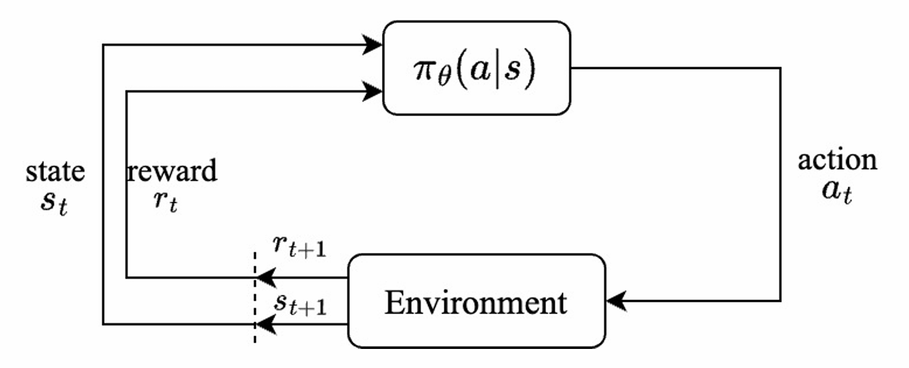
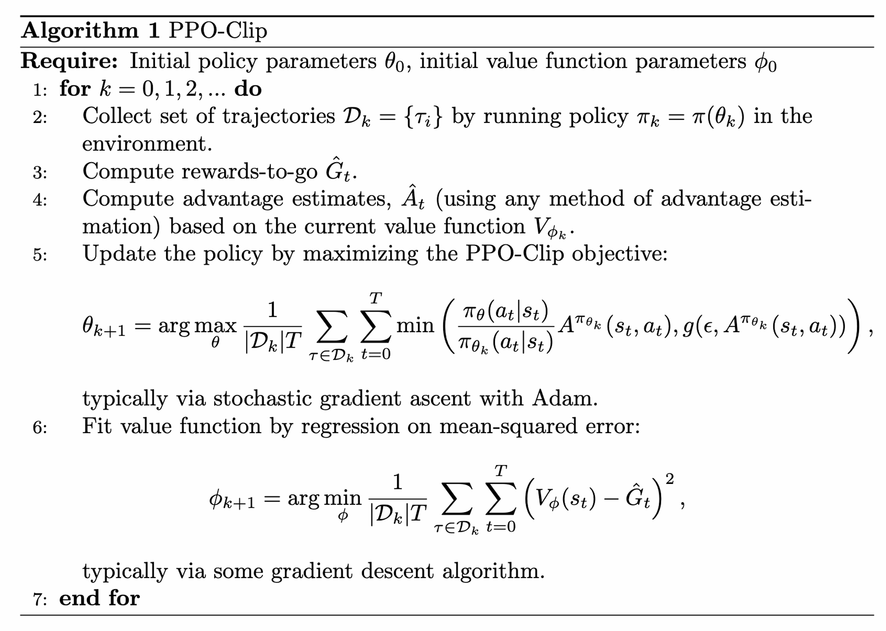

# Lecture14:  Proximal Policy Optimization (PPO)

> Notes taken by [squarezhong](https://github.com/squarezhong)
> Repo address: [squarezhong/SDM5008-Lecture-Notes](https://github.com/squarezhong/SDM5008-Lecture-Notes)

[toc]

## Review: Policy Optimization

- $\pi(a|s)$: Probability of action $a$ in state $s$

- Objective: Maximize expected cumulative reward 

  $\text{max}_{\theta}\ \mathbf{E}_{\tau \sim \pi_{\theta}}\left[\sum_{t=0}^{T}\gamma^t r_t\right]$

## Review: Vanilla Policy Gradient (VPG)

**Input**: Initial $\theta_0$, $V_\phi$

**Repeat**:

1. **Collect trajectories**: $\tau \sim \pi_{\theta}$

2. **For each timestep $t$**:
   - $G_t = \sum_{t'=t}^{T-1} \gamma^{t'-t} r_{t'}$  (return)
   - $A_t = G_t - V_\phi(s_t)$  (advantage function)

3. **Update $V_\phi$**:
   $$
   V_\phi = \text{argmin}_\phi \sum \| V_\phi(s_t) - G_t \|^2
   $$
   
4. **Policy Update**:
   $$
   \theta = \theta + \alpha \sum \nabla_\theta \log \pi_\theta(a_t | s_t) A_t
   $$

## Importance Sampling and Surrogate Loss

- Policy Gradient

$$
J(\theta) = \mathbf{E}[\log \pi_\theta(a_t | s_t) \cdot A(s_t, a_t)]
$$

$$
\nabla_\theta J(\theta) = \mathbf{E}[\nabla_\theta \log \pi_\theta(a_t | s_t) \cdot A(s_t, a_t)]
$$

- Surrogate Loss Function (替代损失函数):

$$
L_{\text{surr}} = 
\frac{\pi_\theta(a_t | s_t)}{\pi_{\text{old}}(a_t | s_t)} A(s_t, a_t)
$$

---

Here we prove that $L_{\text{surr}}$ can replace policy gradient to update the policy

Prove that $\nabla_\theta \mathbf{E}(L_{\text{surr}}) = \nabla_\theta J(\theta)$ when $\theta = \theta_{\text{old}}$
$$
\begin{aligned}
\nabla_\theta \mathbf{E}(L_{\text{surr}}) 
&= \nabla_\theta \mathbf{E}\left[\frac{\pi_\theta(a_t | s_t)}{\pi_{\text{old}}(a_t | s_t)} \cdot A(s_t, a_t)\right]\\
&= \mathbf{E}\left[\nabla_\theta \pi_\theta(a_t | s_t) \cdot \frac{1}{\pi_{\text{old}}(a_t | s_t)} \cdot A(s_t, a_t)\right]\\
&= \mathbf{E}\left[\frac{\pi_\theta(a_t | s_t)}{\pi_{\text{old}}(a_t | s_t)} \cdot \nabla_\theta \log \pi_\theta(a_t | s_t) \cdot A(s_t, a_t)\right]\\
&\approx \mathbf{E}\left[\nabla_\theta \log \pi_\theta(a_t | s_t) \cdot A(s_t, a_t)\right]\\
&= \nabla_\theta J(\theta)
\end{aligned}
$$

---

- It update policy via:

$$
\theta_{k+1} = \text{argmax}_{\theta} \mathop{\mathbf{E}}\limits_{s,a \sim \pi_{\theta_k}}
\left[
L(s,a,\theta_k,\theta)
\right]
$$

- Typically taking multiple steps of SGD to maximize the objective.

##  Proximal Policy Optimization (PPO)

- PPO introduces a clipping mechanism to prevent large, destabilizing updates.

- Clipped objective:
  $$
  L(s,a,\theta_k,\theta) = \min
  \left(
  \frac{\pi_\theta(a|s)}{\pi_{\theta_k}(a|s)} A^{\pi_{\theta_k}}(s, a),
  \text{clip}
  \left(
  \frac{\pi_\theta(a|s)}{\pi_{\theta_k}(a|s)},1-\epsilon,1+\epsilon
  \right)
  A^{\pi_{\theta_k}}(s, a)
  \right)
  $$

  - $\epsilon$ is hyperparameter which roughly says how far away the new policy is allowed to go from the old.

- Clipped objective in another form:
  $$
  L(s, a, \theta_k, \theta) = \min \left( \frac{\pi_\theta(a \mid s)}{\pi_{\theta_k}(a \mid s)} A^{\pi_{\theta_k}}(s, a), \, g(\epsilon, A^{\pi_{\theta_k}}(s, a)) \right), \\
  \text{where}\ 
  g(\epsilon, A) =
  \begin{cases} 
  (1 + \epsilon)A & \text{if } A \geq 0, \\ 
  (1 - \epsilon)A & \text{if } A < 0.
  \end{cases}
  $$
  
- When the advantage is positive:
  - Action $a$ becomes more likely but has a limit.
  - Good action appears more but not too more
- When the advantage is negative:
  - Action $a$ becomes less likely but has a limit.
  - Bad action appears less but not too less.

Pseudo code:

### General Advantage Estimation (GAE)

Advantage $\hat{A}_t^{(k)}$:
$$
\hat{A}_t^{(k)} =
r_t + \gamma r_{t+1} + \gamma^2 r_{t+2} + \cdots +
\gamma^{k} V(s_{t+k}) - V(s)
$$
**GAE** takes a weighted average of $\hat{A}_t^{(k)}$ to balance bias and variance.
$$
\hat{A}_t^{(k)} = A_t^{\text{GAE}} = \sum_k w_k \hat{A}_t^{(k)}
$$

---

The derivation process of a recursive form

- $ w_k = \lambda^{k-1}, \, \lambda \in [0, 1] $
- $ \delta_t = r_t + \gamma V(s_{t+1}) - V(s_t) $

Then:

- $ k=1 $: $ \hat{A}_t^{(1)} = \delta_t $
- $ k=2 $: $ \hat{A}_t^{(2)} = \delta_t + \gamma \delta_{t+1} $
- $ k=3 $: $ \hat{A}_t^{(3)} = \delta_t + \gamma \delta_{t+1} + \gamma^2 \delta_{t+2} $

Takes a weighted average:
$$
\begin{aligned}
\hat{A}_t &= (1-\lambda)(\hat{A}_t^{(1)} + \lambda \hat{A}_t^{(2)} + \lambda^2 \hat{A}_t^{(3)} + \dots)\\
&= (1-\lambda)(\delta_t + \lambda \delta_t + \gamma \lambda \delta_{t+1} + \lambda^2 \delta_t + \gamma \lambda^2 \delta_{t+1} + \gamma^2 \lambda^2 \delta_{t+2} + \dots)\\
&= (1-\lambda) [
\delta_t \left(1 + \lambda + \lambda^2 + \dots\right) 
+ \gamma \delta_{t+1} \left(\lambda + \lambda^2 + \dots\right) 
+ \gamma^2 \delta_{t+2} \left(\lambda^2 + \lambda^3 + \dots\right) + \cdots] \\
&= \delta_t + \gamma \lambda \delta_{t+1} + (\gamma \lambda)^2 \delta_{t+2} + \cdots\\
&= \delta_t + \gamma \lambda \hat{A}_{t+1}
\end{aligned}
$$

Special Case:

- $ \lambda = 0 $: $ \hat{A}_t = \delta_t = \hat{A}_t^{(1)} $
- $ \lambda = 1 $: $ \hat{A}_t = \delta_t + \gamma \hat{A}_{t+1} = \hat{A}_t^{(\infty)} $

---

### Code Example

- [Code Example]([rl-start/notebook/ppo.ipynb at master · clearlab-sustech/rl-start](https://github.com/clearlab-sustech/rl-start/blob/master/notebook/ppo.ipynb))

