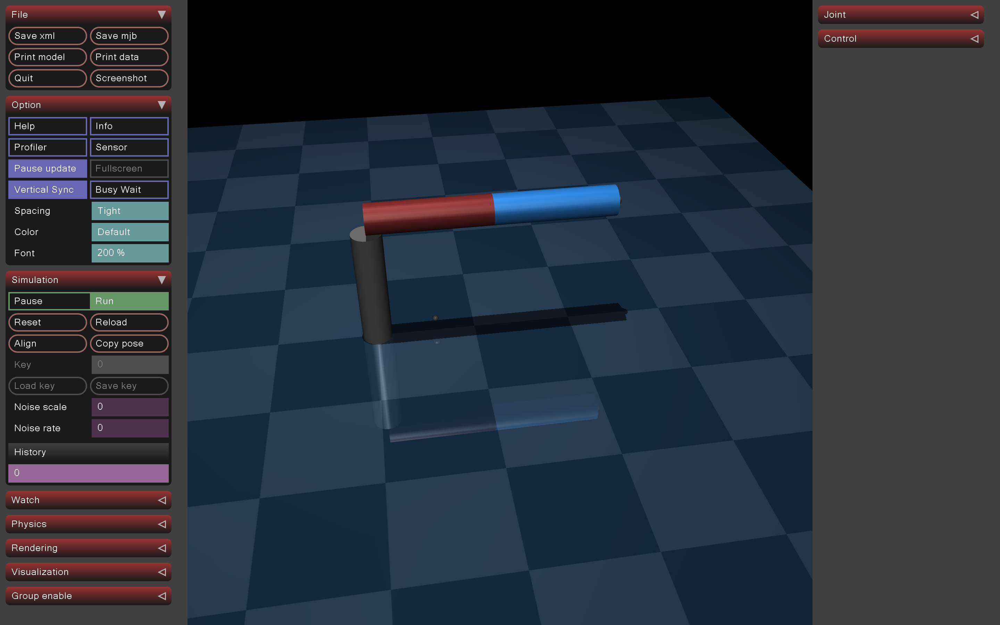

# Lecture8: Mujoco Tutorial

> Notes taken by [squarezhong](https://github.com/squarezhong)
> Repo address: [squarezhong/SDM5008-Lecture-Notes](https://github.com/squarezhong/SDM5008-Lecture-Notes)

[toc]

## Introduction to Simulation

### Definition

- Simulation: model physical world to do **prediction**
- All simulators essentially solve the **ODE**s and/or **PDE**s corresponding to a physical process of interest

### Three pillars of a simulator

1. Constructing the differential equations/models
2. Solving differential equations
3. Visualization of the simulation results

## Introduction to MuJoCo

Open-source robotics simulator maintained by Google Deepmind.

### Define a rigid body system

All position is relative to the current frame.

#### 1. Where is it

Body element (frame): 

- `<pos>`: position
- `<euler>/<quat>/<axisangle>`: frame orientation relative to parent frame

#### 2.  How does it look

geom: sub-element of body

- `<type>`: sphere (default), plane, capsule, ellipsoid, cylinder, box, mesh, sdf
- `<fromto>`: from start position to end position
- `<rgba>`: color
- `<mass>`
- `<density>`: default "1000" (density of water in SI unit)

#### 3. How does it connect to others

Joint: sub-element of body

> a joint creates motion degrees of freedom between the body where it is defined and the body’s parent. 

- `<type>`: 
  - `free`: 6 DoF
  - `slide`: linear
  - `hinge`: **rotation**
- `<pos>`
- `<axis>`: rotation axis for "hinge", direction of translation for "slide"

#### 4. Its physical properties

- (default): infer from geometry attached to the body
- inertia sub-element
  - `<pos>`
  - `<orientation>`
  - `<mass>`
  - `<mass>`
  - `<diaginertia>`: real(3), diagonal entries of the inertia matrix
  - `<fullinertia>`: real(6), full inertia matrix

#### Assets

> Assets are not in themselves model elements. Model elements can reference them

- `asset/mesh`: loaded from external files (e.g. STL ,OBJ .etc)
- `asset/material`: It can be referenced from skins, geoms, sites and tendons to set their appearance.

## Python Example

MuJoCo accepts **MJCF** (Mujoco native) and **URDF** (Unified Robot Description Format) XML model files. Here we use URDF.

Refer to [Official XML Reference](https://mujoco.readthedocs.io/en/stable/XMLreference.html#) is all you need.

```xml
<mujoco model="3R_robot">
    <compiler angle="degree"/>
    <asset>  
        <texture name="grid" type="2d" builtin="checker" rgb1=".1 .2 .3"
        rgb2=".2 .3 .4" width="300" height="300" mark="none"/>
        <material name="grid" texture="grid" texrepeat="6 6" texuniform="true" reflectance=".2"/>
    </asset>
    <default>
        <joint type="hinge" axis="0 0 1" limited="true"/>
        <geom type="cylinder" size=".025 .1" />
    </default>

    <worldbody>
        <light diffuse=".5 .5 .5" pos="0 0 3" dir="0 0 -1"/>
        <geom type="plane" size="1 1 0.1" material="grid"/>        
        <body name="BaseLink" pos="0 0 0.1">  
            <geom type="cylinder" pos="0 0 0" size=".025 .1" />  
            <body name="link1" pos="0 0.1 0.125" euler="-90 0 0">
                <joint name="joint1" pos="0 0 -0.1" range="-90 90" axis ="0 1 0"/>
                <geom pos="0 0 0" rgba=".6 .2 .2 1"/>
                <site name="torque_site" pos="0 0.2 0"/>
                <body name="link2" pos="0 0 0.2">
                    <joint name="joint2" pos="0 0 -0.1" range="-90 90" axis="0 1 0"/>
                    <geom rgba=".2 .6 1 1"/>
                    <site name="end_effector" pos="0 0 0.1" size="0.01"/>
                </body>
            </body>
        </body>
    </worldbody>
</mujoco>
```

Then use a Python script to load it:

```python
import mujoco
import mujoco.viewer

model = mujoco.MjModel.from_xml_path("example.xml")
data = mujoco.MjData(model)

# Start the viewer to visualize the simulation
mujoco.viewer.launch(model, data)
```

It looks like:




